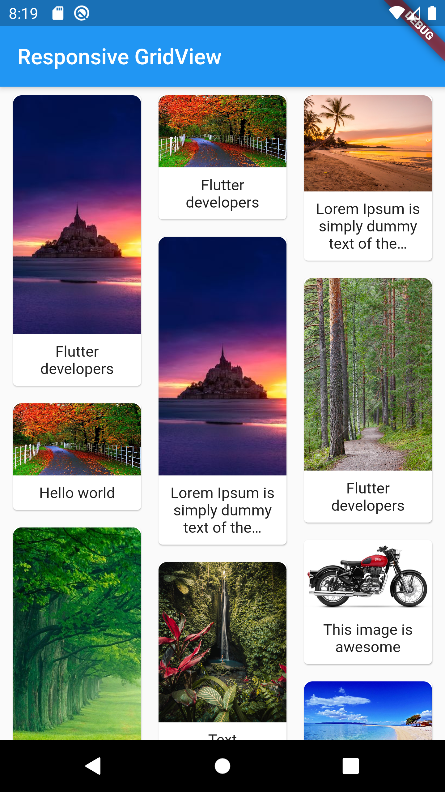

# flutter_responsive_grid

A new Flutter package to create a responsive gridview list with a dynamic number of columns

## Screenshots

 

## Usage

[Example] https://github.com/abdallah-odeh/Responsive-GridView/tree/master/example/main.dart

### To use this package:

 1- Add this following line to your pubspec.yaml
    dependencies:
      flutter:
        sdk: flutter
=>    flutter_responsive_grid:

 2- Simply invoke it inside your widget tree and pass the **children** as a list of widget, **number of columns** as an integer and the **size between each child** as a double [default is 8.0]
    Scaffold(
      appBar: AppBar(),
      body: SingleChildScrollView(
        child: ResponsiveGrid(
          children: children,
          columns: 3,
          sizeBetween: 8.0
        ),
      ),
    )